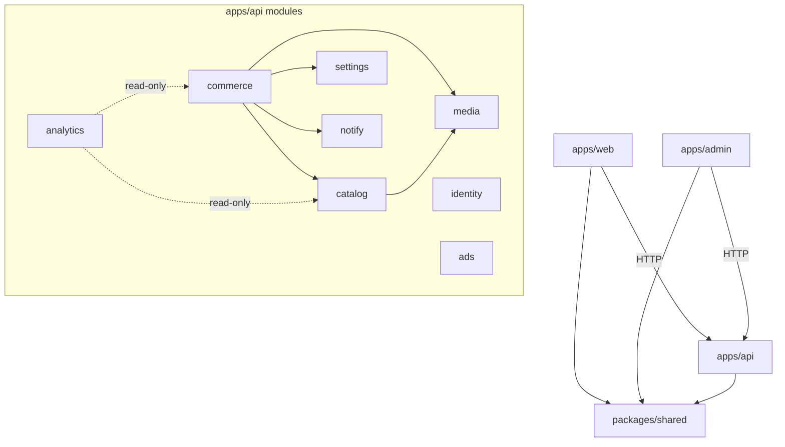
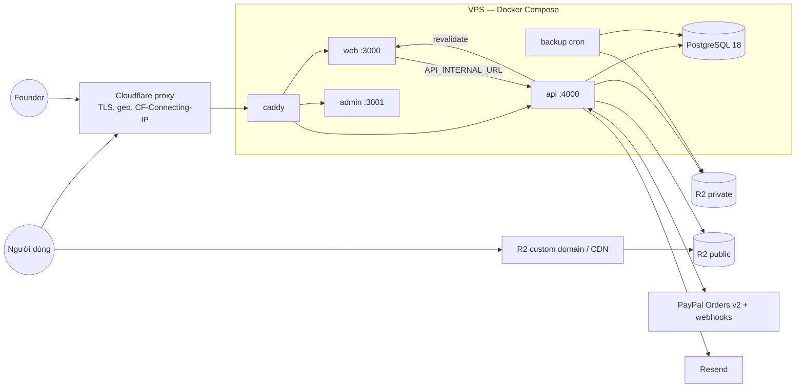
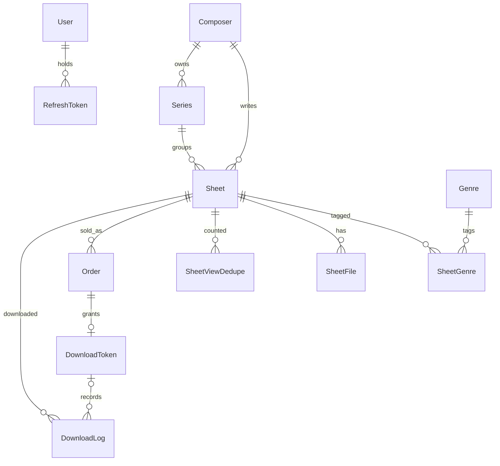

# Architecture Spine — Piano Daily

## Design Paradigm

**Modular monolith.** Một NestJS API là nơi duy nhất nắm nghiệp vụ và dữ liệu. Mỗi module là một bounded context, bên trong phân lớp `controller → service → repository (Prisma)`. `apps/web` (public, SSR) và `apps/admin` là **client mỏng**: chỉ gọi API qua HTTP, không bao giờ chạm DB hay S3.

| Module (`apps/api/src/modules/*`) | Sở hữu |
| --- | --- |
| `catalog` | Sheet, SheetFile, Composer, Genre, SheetGenre, Series, SheetViewDedupe; search; `PricingService`; `CacheInvalidator`; vòng đời file |
| `media` | Adapter S3 (public/private), xử lý PDF/MIDI, signed URL, xoá object theo lệnh `catalog` |
| `commerce` | Order, DownloadToken, DownloadLog, PaymentEvent; `PaymentProvider` (PayPal); luồng tải file |
| `identity` | User (admin), RefreshToken; guard JWT; preview token |
| `ads` | AdSlot |
| `settings` | SiteSetting |
| `analytics` | Không sở hữu bảng; chỉ đọc cho dashboard (FR-17) |
| `notify` | EmailPort + adapter Resend |



## Invariants & Rules

### AD-1 — Mỗi bảng có đúng một module chủ

- **Binds:** all
- **Prevents:** hai module cùng ghi một entity theo hai cách, logic giá/trạng thái bị nhân đôi.
- **Rule:** Chỉ module chủ (bảng trên) được đọc/ghi bảng của nó qua Prisma. Module khác gọi service public của module chủ. Ngoại lệ duy nhất: `analytics` được query read-only. Frontend không có logic nghiệp vụ về giá, quyền tải hay trạng thái.

### AD-2 — `packages/shared` là hợp đồng API duy nhất [ADOPTED]

- **Binds:** all
- **Prevents:** DTO, enum, mã lỗi hoặc tag cache của web/admin lệch với API.
- **Rule:** `packages/shared` chứa:
  - zod schema cho mọi request/response DTO; type suy ra bằng `z.infer`;
  - enum (Level, FileType, OrderStatus, SheetStatus, AdPosition, Role);
  - bảng chuyển trạng thái Order;
  - danh mục mã lỗi;
  - các hàm sinh tên cache tag.

  API validate bằng chính các schema này qua validation standard-schema có sẵn của Nest 12 (fallback: `nestjs-zod` với override peer). Giá trị enum shared phải trùng enum Prisma; có một test kiểm tra điều này.

### AD-3 — Tiền là số nguyên cents USD, server định giá

- **Binds:** FR-7, FR-8, FR-14, FR-17
- **Prevents:** lỗi làm tròn float, giá bị client giả mạo, doanh thu lệch.
- **Rule:** Mọi số tiền là `Int` cents USD ở DB/API/shared (`price_pdf_cents`, …, `amount_cents`); addendum ghi "decimal", spine này thay thế. Không endpoint nào nhận giá làm giá cuối từ client (xem AD-17). `Order.items` chụp snapshot type và giá lúc tạo.

### AD-4 — Máy trạng thái Order và fulfil idempotent

- **Binds:** FR-8, FR-9, FR-10, FR-15
- **Prevents:** capture và webhook chạy đua nhau làm cấp hai token hoặc cộng doanh thu hai lần; thanh toán đến muộn bị mất; hoàn tiền từ admin và từ webhook không đồng bộ.
- **Rule:**
  - **Chủ và chuyển trạng thái:** chỉ `commerce.OrderService` được đổi `Order.status`, theo bảng chuyển trạng thái trong shared: `PENDING→PAID|FAILED|CANCELLED`, `CANCELLED|FAILED→PAID` (chỉ khi thanh toán đến muộn, đã được PayPal xác nhận), `PAID→REFUNDED`.
  - **`fulfil()`:** capture endpoint và webhook `COMPLETED` cùng gọi `fulfil()`. Hàm này xác minh amount và currency khớp Order, rồi `UPDATE … WHERE status IN (allowed)`, set `paid_at` và tạo DownloadToken **trong cùng transaction**.
    - Nếu 0 dòng được cập nhật: đọc lại Order. Đã `PAID` thì không làm gì. Trạng thái khác thì log error.
    - Nếu lệch số tiền: đặt `review_required=true` và log error. Không bao giờ bỏ qua trong im lặng.
  - **Webhook:** luôn insert `PaymentEvent(provider_event_id UNIQUE)` trước; nếu trùng thì dừng.
  - **Kết quả capture:** capture luôn trả `{orderCode, token, files}` khi Order đã `PAID`, kể cả khi webhook xử lý xong trước.
  - **Cron huỷ Order:** Order `PENDING` quá 24h chỉ bị chuyển `CANCELLED` sau khi `GET order` từ PayPal cho thấy chưa `APPROVED`/`COMPLETED`.
  - **Refund:** refund (từ admin hoặc webhook) đi qua `refund()` có điều kiện: set `REFUNDED`, `refunded_at`, và vô hiệu hoá token.

### AD-5 — PayPal nằm sau `PaymentProvider` port

- **Binds:** FR-8, FR-10, FR-15
- **Prevents:** SDK PayPal rò rỉ vào nghiệp vụ, khó thêm cổng thanh toán nội địa sau này (PRD Q2).
- **Rule:** `commerce` định nghĩa port `createOrder / getOrder / capture / refund / verifyWebhook`, và chỉ adapter `paypal` import `@paypal/paypal-server-sdk`. SDK không có hàm verify webhook, nên adapter gọi REST `POST /v1/notifications/verify-webhook-signature` với raw body (Nest `rawBody: true`) và `PAYPAL_WEBHOOK_ID`, trước mọi xử lý. Chế độ sandbox/live chọn qua `PAYPAL_MODE`.

### AD-6 — Hai vùng lưu trữ; file gốc chỉ qua signed URL

- **Binds:** FR-4, FR-5, FR-9, FR-13, NFR bảo mật file
- **Prevents:** lộ URL gốc của file bán; frontend tự ghép URL storage.
- **Rule:** Chỉ `media` nói chuyện với S3 (`@aws-sdk/client-s3`; endpoint cấu hình qua env; với R2 đặt `requestChecksumCalculation/responseChecksumValidation: 'WHEN_REQUIRED'`).
  - **public** (qua CDN): thumbnail, page image (webp), MIDI note-JSON cho player. Key chứa content hash nên được cache vĩnh viễn (immutable).
  - **private**: PDF/MIDI/MP3 gốc và backup DB. Chỉ phát signed GET URL TTL 5 phút.
  - Response public chỉ chứa URL public đã resolve. `storage_key` và URL private không bao giờ xuất hiện ra ngoài.
  - Key: `{public|private}/sheets/{sheetId}/{fileType}/{hash}.{ext}`.

### AD-7 — MIDI player dùng note-JSON, không dùng file `.mid` gốc

- **Binds:** FR-5, FR-9
- **Prevents:** player bắt buộc phải công khai file `.mid` đang được bán.
- **Rule:** Khi upload MIDI, `media` chuyển file sang note-JSON (`@tonejs/midi`, chạy server-side) rồi lưu vào vùng public. Player (Tone.js) chỉ đọc JSON này. Dữ liệu nốt có thể bị trích xuất, và điều đó được chấp nhận: thứ được bán là file `.mid`/PDF/MP3 tiện dùng.

### AD-8 — Một đường tải file duy nhất

- **Binds:** FR-7, FR-9, FR-14, FR-18
- **Prevents:** có đường tải thứ hai bỏ qua kiểm tra quyền tải; lượt tải bị đếm vượt khi request đến đồng thời; người mua cũ bị bắt trả tiền lại.
- **Rule:** Mọi lượt tải đều đi qua `commerce/download`:
  - **Sheet `is_free` và `PUBLISHED`:** `GET /files/:sheetId/:fileType/download` (có rate limit) → 302 tới signed URL.
  - **Sheet trả phí:** `GET /downloads/:token/:fileType`.
    - Token hợp lệ khi Order `PAID`, token chưa bị vô hiệu, chưa hết hạn và file type thuộc Order. Token hợp lệ thì tải được **bất kể `Sheet.status`**.
    - Một câu `UPDATE … SET used=used+1 WHERE id=? AND used<max AND expires_at>now()` → ghi DownloadLog → 302.
    - `GET /downloads/:token` trả danh sách file và trạng thái token (dùng cho trang tải lại, kể cả trạng thái "hết hạn/hết lượt").
  - **Mua lại cùng email:** `create-order` tìm Order `PAID` cùng email và sheet, có token còn hiệu lực bao phủ các type được yêu cầu. Nếu có: gửi lại email (rate limit theo email) và trả `ALREADY_PURCHASED`. Response không bao giờ chứa token.
  - **Token:** hạn dùng và số lượt được chụp vào DownloadToken lúc phát. Gia hạn hoặc vô hiệu token chỉ qua `commerce.TokenService`.
  - **`payments_enabled=false`:** chỉ chặn `create-order` (trả `PAYMENTS_DISABLED`; nút tải của sheet trả phí hiển thị ở trạng thái không khả dụng). Token đã phát vẫn tải được.

### AD-9 — Upload xử lý đồng bộ, commit sau cùng

- **Binds:** FR-13
- **Prevents:** Sheet bị lưu khi còn thiếu file; object bị mồ côi trên storage.
- **Rule:** `POST /admin/sheets/:id/files` (thuộc `catalog`, gọi `media`) validate mime/size (PDF/MP3 ≤ 20MB, MIDI ≤ 2MB), rồi xử lý ngay trong request, **ngoài transaction**: PDF → `pdftoppm` + `sharp` ra page image webp và thumbnail; MIDI → note-JSON. Chỉ khi mọi object đã lưu xong mới mở transaction: ghi SheetFile mới, đánh `superseded_at` cho file cũ cùng type, rồi `recomputeDerived()` (AD-16). Nếu lỗi thì xoá các object vừa ghi. v1 không có hàng đợi.

### AD-10 — Public web: SSR + cache theo tag do API kích hoạt

- **Binds:** FR-1–FR-4, FR-7, FR-16, FR-18, FR-20
- **Prevents:** tắt quảng cáo, publish hoặc đổi Level mà trang cũ vẫn hiển thị; giá cũ bị cache.
- **Rule:**
  - **Tag:** tên tag chỉ được sinh bằng hàm trong shared: `sheet:{id}`, `list:level:{level}`, `list:composer:{id}`, `list:genre:{id}`, `list:series:{id}`, `search`, `ads`, `settings`, `sitemap`.
  - **Fetch trên web:** fetch dữ liệu public dùng `cache: 'force-cache', next: { tags, revalidate: 600 }`; `revalidate: 600` là lưới an toàn.
  - **Revalidate:** sau mỗi commit, `catalog.CacheInvalidator.tagsFor(before, after)` tính tập tag (gồm cả Level/Composer/Genre/Series **cũ và mới**). API gọi `POST {API→WEB}/api/revalidate` (có secret, retry 3 lần). Route handler gọi `revalidateTag(tag, { expire: 0 })`.
  - **Không bật `cacheComponents`** (next-intl chưa hỗ trợ).
  - **Giá:** giá trong modal fetch `no-store` lúc mở modal.
  - **Draft/Archived:** trả 404 ở mọi route public, trừ route preview (AD-19).

### AD-11 — Đếm lượt xem bằng beacon, dedupe trong Postgres

- **Binds:** FR-4, FR-17
- **Prevents:** trang cache không đếm được lượt xem; một lượt refresh bị đếm trùng.
- **Rule:** Client gửi `POST /sheets/:id/view`. `catalog` chèn vào `SheetViewDedupe(sheet_id, visitor_hash, hour_bucket)` có UNIQUE; chỉ khi chèn thành công mới `view_count+1`. `visitor_hash = sha256(clientIp + ua + VIEW_SALT)` với IP lấy theo AD-18, không lưu IP thô. Không dùng Redis.

### AD-12 — Locale nằm trên URL, IP chỉ quyết định lần đầu

- **Binds:** FR-19, FR-20
- **Prevents:** crawler bị redirect theo IP; lựa chọn ngôn ngữ thủ công bị IP ghi đè.
- **Rule:**
  - **URL:** mọi route public có tiền tố `/vi` hoặc `/en` (`next-intl`, có `hreflang`).
  - **Redirect:** `apps/web/src/proxy.ts` (Next 16) bọc `createMiddleware` của next-intl bằng redirect tự viết, chỉ áp cho path **không có tiền tố**, theo thứ tự: cookie `NEXT_LOCALE` → header `cf-ipcountry == VN` → `vi`, còn lại → `en`. `localeCookie.maxAge` = 1 năm. URL đã có tiền tố không bao giờ bị redirect.
  - **Phạm vi dịch:** chỉ UI chrome được dịch; nội dung Sheet chỉ có một phiên bản, giá luôn hiển thị USD.
  - **Hạ tầng:** Cloudflare phải bật IP Geolocation.

### AD-13 — Auth admin: deny-by-default [ADOPTED]

- **Binds:** FR-11, FR-12–FR-18
- **Prevents:** có endpoint admin quên gắn guard; token không thu hồi được.
- **Rule:**
  - **Guard:** guard JWT là global trên toàn API; route public phải đánh dấu tường minh `@Public()`. Có một test liệt kê mọi route và chỉ cho phép các route nằm trong allowlist được `@Public()`.
  - **Token:** access JWT hạn 15 phút, giữ trong bộ nhớ của admin app. Refresh token xoay vòng, đặt trong cookie `httpOnly; Secure; SameSite=Strict; Path=/auth`, lưu hash ở `RefreshToken`; logout thì thu hồi.
  - **Mật khẩu và vai trò:** hash bằng bcrypt; `/auth/login` có throttle. v1 chỉ có `SUPER_ADMIN` (enum vẫn giữ `EDITOR`).
  - **Admin app:** chỉ fetch dữ liệu client-side, không fetch dữ liệu admin trong server component.

### AD-14 — Email best-effort sau commit

- **Binds:** FR-9, FR-15
- **Prevents:** lỗi gửi email làm rollback một thanh toán đã thành công.
- **Rule:** `notify.EmailPort` (adapter Resend) chỉ được gọi sau khi transaction commit. Gửi lỗi thì ghi log, còn `Order.email_sent_at` để null. Admin có thể gửi lại (FR-15). Người mua luôn tải được ngay trên trang `/[locale]/downloads/[token]` mà client chuyển tới sau khi capture.

### AD-15 — API chạy một instance

- **Binds:** vận hành, NFR rate limit
- **Prevents:** chạy nhiều bản API khiến rate limit và cron bị sai hoặc chạy trùng.
- **Rule:** Throttler dùng bộ nhớ trong (`@nestjs/throttler`), cron dùng `@nestjs/schedule` (huỷ Order `PENDING`, GC file). Muốn scale ngang thì trước hết phải chuyển throttle/cron sang store dùng chung (khi đó cần một AD mới). API chạy `prisma migrate deploy` trước khi listen.

### AD-16 — Vòng đời Sheet và trường dẫn xuất

- **Binds:** FR-12, FR-13, FR-9
- **Prevents:** xoá Sheet đã bán làm mất doanh thu và chặn người mua; nhiều nơi cùng ghi `has_*`/`page_count` gây mất cập nhật; publish một Sheet chưa đủ file.
- **Rule:**
  - **Trạng thái:** `SheetStatus = DRAFT | PUBLISHED | ARCHIVED`. "Xoá" trên admin nghĩa là `ARCHIVED`. Hard delete chỉ được phép khi Sheet chưa từng có Order. FK từ Sheet tới Composer/Series và từ Order tới Sheet đều `RESTRICT`.
  - **Trường dẫn xuất:** `has_*`, `page_count` và thumbnail chỉ do `catalog.recomputeDerived(sheetId)` ghi (`SELECT … FOR UPDATE` trên sheet); không DTO nào nhận các trường này. Có partial unique index: mỗi `(sheet_id, type)` với PDF/MIDI/MP3 chỉ có một file chưa `superseded_at`. Xoá file đi qua endpoint riêng.
  - **Xoá object S3:** chỉ do cron GC của `catalog` quyết định, `media` thực thi, và chỉ khi không còn token sống tham chiếu tới file.
  - **Điều kiện publish (kiểm server-side):** có PDF đã xử lý, có Composer và Level. Sheet không free cần ít nhất một type mua được (AD-17). Slug bị đóng băng sau lần publish đầu tiên.

### AD-17 — Báo giá một nguồn

- **Binds:** FR-7, FR-8, FR-14
- **Prevents:** modal hiển thị một bộ lựa chọn, `create-order` tính theo bộ khác; Bundle không xác định được khi Sheet thiếu MP3; giá đổi giữa lúc mở modal và lúc đặt.
- **Rule:**
  - **Nguồn duy nhất:** `catalog.PricingService.quote(sheetId)` là nguồn duy nhất, dùng cho cả `GET /sheets/:id/quote` (modal) và `create-order`.
  - **Type mua được:** có file hiện hành và giá > 0.
  - **BUNDLE:** chỉ tồn tại khi có ít nhất 2 type mua được, và bao gồm mọi type mua được. `Order.items` lưu các type đã resolve, không lưu chuỗi `'BUNDLE'`.
  - **Kiểm tra giá:** client gửi `expectedTotalCents`; nếu lệch với quote hiện tại, API trả `PRICE_CHANGED` kèm quote mới.

### AD-18 — Biên HTTP: IP khách, URL nội bộ, CORS

- **Binds:** AD-11, AD-15, FR-9, NFR bảo mật
- **Prevents:** mọi người dùng chung một IP proxy (throttle và view hash sai); SSR bị throttle như một client; CORS/cookie mỗi app cấu hình một kiểu.
- **Rule:**
  - **IP khách:** chỉ lấy qua helper `getClientIp()`, đọc `CF-Connecting-IP`. Caddy đặt `trusted_proxies` = dải IP Cloudflare, và origin chỉ nhận kết nối từ Cloudflare.
  - **URL API:** SSR của web gọi `API_INTERNAL_URL` trong mạng docker, kèm `X-Internal-Secret` (bỏ qua throttle). Browser gọi `NEXT_PUBLIC_API_URL`.
  - **CORS:** chỉ cho allowlist origin tường minh; `credentials` chỉ bật cho origin admin.
  - **Header bảo mật:** `helmet` trên API. Web có CSP cho phép domain PayPal, YouTube và CDN.

### AD-19 — Xem trước Draft

- **Binds:** FR-12, EXPERIENCE UJ-3
- **Prevents:** admin không xem trước được Draft, hoặc lộ Draft ra public.
- **Rule:** Admin xin từ `identity` một preview token (ký, 10 phút, gắn `sheetId`). Web route `/[locale]/preview/sheet/[id]?token=` render `no-store` + `noindex` và không đếm view. Không có token hợp lệ thì trả 404.

### AD-20 — Số liệu tải lấy từ DownloadLog

- **Binds:** FR-9, FR-17
- **Prevents:** tải miễn phí không được đếm; counter lệch với log; doanh thu mỗi nơi tính theo một múi giờ.
- **Rule:** Mọi lượt tải thành công, miễn phí lẫn trả phí, đều ghi `DownloadLog(sheet_id, file_type, token_id nullable, ip_hash, ua, created_at)` trong cùng transaction với việc kiểm tra quyền tải. Không có cột `download_count`: `analytics` tính từ log. Doanh thu = tổng `amount_cents` theo `paid_at`, trừ các Order có `refunded_at`; ngày được tính theo `REPORT_TZ=Asia/Ho_Chi_Minh`.

### AD-21 — Quảng cáo chạy trong iframe sandbox

- **Binds:** FR-16, bảo mật thanh toán
- **Prevents:** script quảng cáo chạy cùng document với PayPal SDK.
- **Rule:** `AdSlot.html_code` chỉ render trong `<iframe sandbox="allow-scripts allow-popups" srcdoc>`, không có `allow-same-origin`. Không bao giờ chèn trực tiếp vào DOM. Chỉ SUPER_ADMIN được nhập nội dung quảng cáo.

## Consistency Conventions

| Concern | Convention |
| --- | --- |
| ID | UUIDv7 (string) cho mọi PK. `Sheet.public_id` là số tự tăng (dùng cho "tìm theo ID"). `Order.order_code` = `PD-` + 6 ký tự base32 |
| Slug | Sinh tự động từ tiêu đề (bỏ dấu), unique; đóng băng sau lần publish đầu (AD-16) |
| Tên | Prisma model PascalCase, cột snake_case (`@map`); JSON field camelCase; file kebab-case |
| Thời gian | Lưu `timestamptz` UTC; API trả ISO-8601 UTC; frontend format theo locale; báo cáo theo `REPORT_TZ` |
| Response | Thành công trả resource trực tiếp; list trả `{items, page, pageSize, total}`; lỗi trả `{error:{code, message, details?}}` với `code` SCREAMING_SNAKE lấy từ danh mục trong shared (vd. `PAYMENTS_DISABLED`, `PRICE_CHANGED`, `ALREADY_PURCHASED`, `PAYMENT_DECLINED`, `TOKEN_EXPIRED`, `TOKEN_EXHAUSTED`) |
| Route API | Public không prefix; `/admin/*`; `/auth/*`; `/payments/paypal/*`; `/webhooks/paypal`; `/downloads/*`; `/sitemap-entries` |
| Route web | `/[locale]/{level,search,composer,genre,sheet}/…`, `/[locale]/downloads/[token]`, `/[locale]/preview/sheet/[id]`; sitemap do web sinh từ `GET /sitemap-entries` |
| Search | Postgres FTS: cột `tsvector` generated trên title + tên composer + lyrics với `unaccent` + config `simple`, GIN index; SQL thô chỉ nằm trong repository `catalog`; query toàn số thì khớp `public_id` |
| Config | Chỉ đọc từ env qua `ConfigModule` đã validate bằng zod lúc khởi động (thiếu biến thì app không chạy); `.env.example` liệt kê đủ. Prisma 7 không tự nạp `.env`, nên nạp trong `prisma.config.ts` |
| Prisma | Generator `prisma-client`, `output` trong `apps/api/src/generated`, `moduleFormat = "cjs"`, dùng `@prisma/adapter-pg`; `apps/api` là CommonJS |
| Log | `pino` JSON (`nestjs-pino`); mỗi request có `requestId`; không log email đầy đủ, token, secret hay IP thô |
| Style UI | Token "Ivory & Walnut" (DESIGN.md) đặt tại `packages/tokens` dạng Tailwind v4 `@theme`; web và admin cùng import |

## Stack

Pin **chính xác** các phiên bản có ghi chú "exact".

| Name | Version |
| --- | --- |
| Node.js (LTS) / base image API | 24.21 / `node:24.21-bookworm-slim` + `poppler-utils` |
| pnpm workspaces + Turborepo | 12.6 / 2.11 |
| TypeScript (exact; Nest CLI chưa hỗ trợ TS 7) | 6.0.3 |
| Next.js (web + admin) / React | 16.3 / 19.3 |
| Tailwind CSS / shadcn CLI (admin) | 4.3 / 4.21 |
| next-intl | 4.14 |
| NestJS core / config / schedule / throttler | 12.1 / 12.0 / 12.0 / 6.7 |
| Prisma CLI + client + adapter-pg (exact; CLI `latest` là 8.0 rc) | 7.10.0 |
| PostgreSQL | 18.6 |
| zod | 4.6 |
| @paypal/paypal-server-sdk / @paypal/react-paypal-js | 2.5 / 10.5 |
| @aws-sdk/client-s3 | 3.x |
| Cloudflare R2 (prod) / SeaweedFS (local S3; MinIO đã bị archive) | — / 4.47 |
| sharp | 0.35 |
| Tone.js / @tonejs/midi | 15.1 / 2.0 |
| Resend | 6.30 |
| pino / nestjs-pino | 10.3 / 5.2 |
| Caddy (reverse proxy) | 2.x |

## Structural Seed

```text
piano-daily/
  apps/
    web/          # Next.js public: src/app/[locale]/..., src/proxy.ts, app/api/revalidate
    admin/        # Next.js admin + shadcn/ui (client-side data)
    api/          # NestJS: src/modules/{catalog,media,commerce,identity,ads,settings,analytics,notify}
      prisma/     # schema.prisma + migrations (có SQL tay cho FTS, partial index)
  packages/
    shared/       # zod schemas, enums, error codes, order transitions, cache-tag builders
    tokens/       # Ivory & Walnut @theme
  docker-compose.yml        # local: web, admin, api, postgres, seaweedfs
  docker-compose.prod.yml   # prod: web, admin, api, postgres, caddy, backup
  .env.example
```



Domain: `pianodaily.<tld>` (web), `admin.` (admin), `api.` (API), `cdn.` (public assets). Tất cả cùng một site nên cookie `SameSite=Strict` dùng được.

Môi trường: **local** (compose, SeaweedFS, PayPal sandbox) và **production** (`PAYPAL_MODE=live`). Không có staging riêng [ASSUMPTION]. Backup: service `backup` chạy `pg_dump` hằng đêm lên R2 private.



`PaymentEvent`, `AdSlot`, `SiteSetting` là các bảng đứng riêng.

## Capability → Architecture Map

| Capability | Lives in | Governed by |
| --- | --- | --- |
| FR-1–3 Duyệt/tìm kiếm | web `/[locale]/level,search,composer,genre` · `catalog` | AD-1, AD-10, AD-12, Search conv. |
| FR-4 Chi tiết Sheet, view count | web `/[locale]/sheet/[slug]` · `catalog` | AD-6, AD-10, AD-11, AD-18 |
| FR-5 MIDI player | web (Tone.js) · `media` note-JSON | AD-7 |
| FR-6 YouTube | web (lazy iframe) | AD-10, AD-18 (CSP) |
| FR-7–9 Thanh toán, token, tải | web modal + `/downloads/[token]` · `commerce`, `catalog.PricingService` | AD-3, AD-4, AD-5, AD-8, AD-14, AD-17, AD-20 |
| FR-10 Webhook | `commerce` `/webhooks/paypal` | AD-4, AD-5 |
| FR-11 Đăng nhập admin | admin · `identity` | AD-13 |
| FR-12–14 CRUD, upload, giá | admin · `catalog`, `media` | AD-1, AD-3, AD-9, AD-10, AD-16, AD-17, AD-19 |
| FR-15 Đơn hàng | admin · `commerce` | AD-4, AD-8, AD-14 |
| FR-16 Quảng cáo | admin · `ads` · web | AD-10, AD-21 |
| FR-17 Dashboard | admin · `analytics` | AD-1, AD-3, AD-20 |
| FR-18 Settings | admin · `settings` | AD-8, AD-10 |
| FR-19 Song ngữ | web `proxy.ts` | AD-12, AD-18 |
| FR-20 SEO | web (metadata, JSON-LD, sitemap) | AD-10, AD-12 |

## Deferred

- **Bulk pricing UX** (FR-14): chi tiết để lại cho story; bắt buộc đi qua `catalog` và tuân theo AD-3/AD-17.
- **Hàng đợi xử lý nền** (BullMQ/Redis): chỉ cần khi upload đồng bộ (AD-9) quá chậm, hoặc khi scale ngang (AD-15).
- **Staging, CI/CD, giám sát/alert**: xem lại trước khi bật `PAYPAL_MODE=live`; tối thiểu là CI build/test và uptime check, cùng alert cho log `review_required`/`LATE_CAPTURE`.
- **Test framework và chiến lược test**: giao cho `bmad-testarch-test-design`/`framework`.
- **Phương thức thanh toán nội địa** (PRD Q2): đã có chỗ cắm qua AD-5.
- **Rà soát bản quyền trước khi live** (PRD Q1): quy trình vận hành, không phải quyết định kiến trúc.
- **Token riêng cho mua lẻ và Bundle** (PRD Q3): v1 dùng chung cấu hình mặc định 7 ngày/5 lượt (AD-8).
- **Nâng TypeScript 7 / Node 26 LTS**: chờ Nest CLI hỗ trợ TS 7.1; Node 24 vào giai đoạn maintenance từ 2026-10-20 (vẫn được hỗ trợ), nâng lên 26 LTS sau khi 26 ổn định.
- **API validation của Nest 12**: xác nhận tên API chính xác khi scaffold; nếu không phù hợp thì dùng fallback `nestjs-zod` (AD-2).
